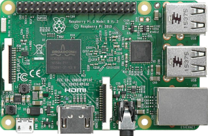

The Walnuts Pi
===

This is the source code for https://thewalnutspi.ml.

It isn't hosted on a Raspberry Pi.

Updates
---

- 25/02/2017: Added Kill My Pi website
- 25/02/2017: Added information for pi-4

- 24/02/2017: Added updates section
- 24/02/2017: Created DNS records for pi-4
- 24/02/2017: Destroyed the data on pi-2

- 22/02/2017: Setup IPv6 on pi-1, pi-2 and pi-3
- ~20/02/2017: Created pi-1-thewalnutspi.duckdns.org, pi-2.duckdns.org and pi-3.duckdns.org DNS records on [DuckDNS](https://www.duckdns.org)
- ~>18/02/2017: Setup CloudFlare on thewalnutspi.ml
